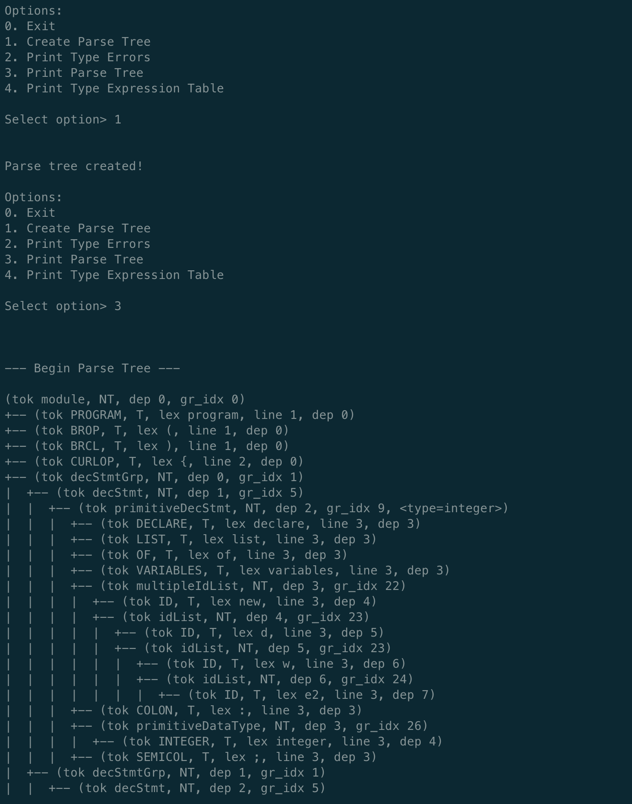
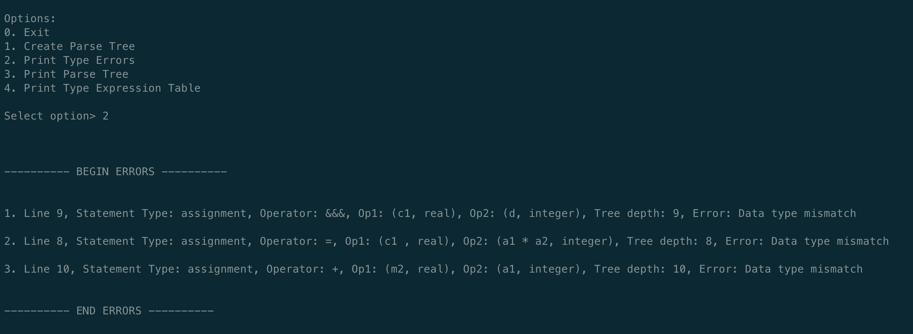
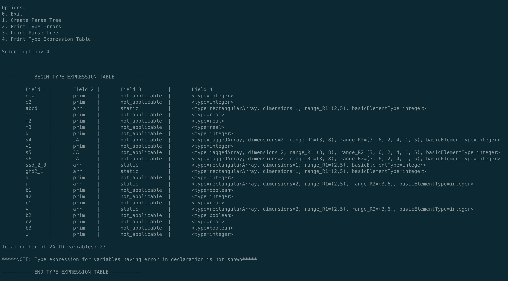

# Dummy Compiler
This is an implementation for a compiler for a basic language developed as part of a university course. The focus has been on correctness and not efficiency. This document highlights key aspects of the project for my final stage interview at Maven Securities. To view the rules of the language and the complete problem statement, please refer to the [problem statement](https://github.com/sarthak-sehgal/ppl-assignment/blob/master/problem_statement.pdf).

## Implementation details
As mentioned in the problem description, all implementation will be required to be done in C programming language. You should use the Ubuntu (version 20.04.1 LTS) and GCC (version 9.3.0) strictly for all your implementations.

## Language description - key points
* Only declaration and assignment statements. All declarations come before assignment.
* Data types: integer, real, boolean, arrays
* Arrays:
  * Rectangular (static and dynamic, any no. of dimensions) and Jagged (static, 2/3 dimensions)
  * Basic type would only be an int
* Expression can be arithmetic or boolean and is constructed recursively
* Support for operator precedence
* Must have at least one declaration and one assignment statement
* Text level static constants are only integers (not floats or booleans)
* Blank space delimited between entities
* Syntax for declarations:
  ```
  declare v1 : integer
  ```
  ```
  declare list of variables : a1 a2 integer;
  ```
  ```
  declare list of variables u v : array [ low_1 .. high_1 ] [ low_2 .. high_2 ] of integer ;
  ```
  ```
  declare list of variables s1 s2 : jagged array [ 3 .. 8 ] [ ] of integer ;
  R1 [ 3 ] : size 3 : values { 20 ; 35 ; 54 }
  R1 [ 4 ] : size 6 : values { 65 ; 89 ; 99 ; 11 ; 37 ; 11 }
  ...
  ```

## Expected Results
1. Grammar for the language and parser for grammer text file
2. Tokeniser for the source code
3. Generate Parse Tree
4. Generate Type Expression Table
5. Semantic error checker

## Key Highlights
* Collaborated with teammate remotely, worked on the same repository maintaining git discipline (atomic commits, branching, README). Wrote over 6k lines of code.
* Achieved all expected results. Devised context free grammar for the given language and developed tokeniser, parse tree, type expression table, and semantic error checker.
* Implemented data structures including hash table, dynamic array, linked list and n-ary tree from scratch.
* Algorithmic implementation of the parse tree construction (push down automata) - applied backtracking to iterate over the token stream (a linked list) and construct the n-ary tree.

## Sample Source Code
[t1.txt](./t1.txt), [t2.txt](./t2.txt), [t3.txt](./t3.txt), [t4.txt](./t4.txt), [t5.txt](./t5.txt), [t6.txt](./t6.txt), [t7.txt](./t7.txt)

## Grammar
[grammar.txt](./grammar.txt)

## Sample Screenshots
### Parse Tree


### Type Errors


### Type Expression Table


## Running locally
```
git clone https://github.com/sarthak-sehgal/dummy-compiler

cd dummy-compiler

make run && ./output t1.txt
```
Note: t1.txt is a sample source code file. The argument can be replaced by any other file (eg: `make run && ./output your_source_code.txt`)